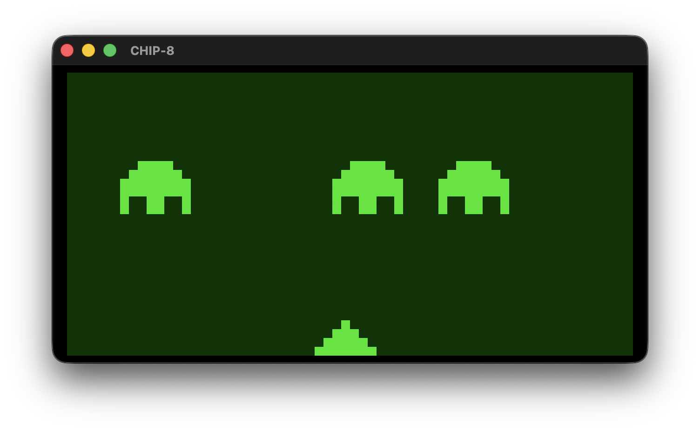

# A CHIP-8 emulator
A CHIP-8 emulator in C.

## Documentation
* https://en.wikipedia.org/wiki/CHIP-8
* http://devernay.free.fr/hacks/chip8/C8TECH10.HTM
* https://tobiasvl.github.io/blog/write-a-chip-8-emulator/
* https://www.laurencescotford.net/2020/07/14/chip-8-ram-or-memory-management-with-chip-8/
* https://github.com/Timendus/chip8-test-suite
* https://www.zophar.net/pdroms/chip8/chip-8-games-pack.html

## Examples

### Disassembly
Use the terminal version to print the disassembly of the loaded program.
```
% make terminal
% ./chip8 -disasm
200: 00e0 cls
202: c00f rnd  %0, 0x0f
204: f029 fnt  %0
206: 611c ld   %1, 0x1c
208: 620e ld   %2, 0x0e
20a: d125 drw  %1, %2, 0x05
20c: 631e ld   %3, 0x1e
20e: f315 ld   $dt, %3
210: f407 ld   %4, $dt
212: 3400 se   %4, 0x00
214: 1210 jp   0x210
216: d125 drw  %1, %2, 0x05
218: 1202 jp   0x202

% ./chip8 -disasm ~/Downloads/c8games/PONG
...
```

### Space Invaders, from the CHIP-8 games pack, running on macOS
Launch the CHIP-8.app application and drag and drop INVADERS ROM file
```
% make run
```



### Space Invaders, from the CHIP-8 games pack, running in the terminal
```
% make terminal
% ./chip8 ~/Downloads/c8games/INVADERS
```


